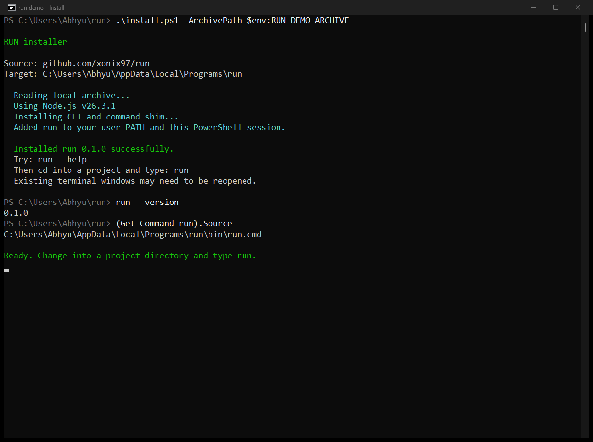
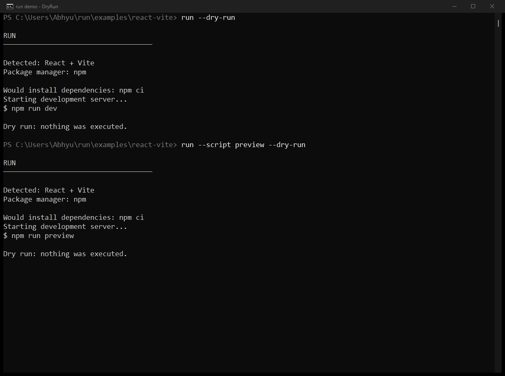
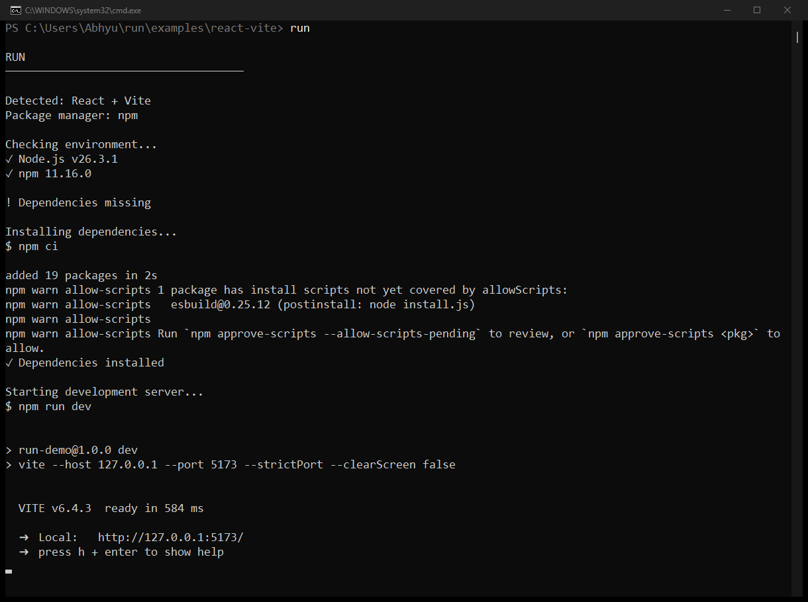

# run

`run` is a zero-configuration project launcher. Run it from a project directory and it detects the stack, checks the required tools, installs missing dependencies, and starts the most likely development command.

```text
~/projects/my-app $ run

RUN
────────────────────────────────────

Detected: React + Vite
Package manager: npm

Checking environment...
✓ Node.js v22.14.0
✓ npm 10.9.2
! Dependencies missing

Installing dependencies...
$ npm ci
✓ Dependencies installed

Starting development server...
$ npm run dev
```

## Install

### Windows: one command in PowerShell

```powershell
(iwr -useb https://raw.githubusercontent.com/xonix97/run/main/install.ps1).Content | iex
```

Or, with `Invoke-RestMethod`:

```powershell
irm https://raw.githubusercontent.com/xonix97/run/main/install.ps1 | iex
```

Then change into a project and run it:

```powershell
cd C:\projects\my-app
run
```

**No npm account, Git, or administrator access required.** The installer:

- Downloads the CLI directly from `xonix97/run` on GitHub.
- Installs to `%LOCALAPPDATA%\Programs\run`.
- Adds its `bin` directory to your **user PATH** and the current PowerShell session. Other open terminals may need to be restarted.
- Uses Node.js 18+ if installed; otherwise downloads portable Node.js LTS from `nodejs.org`, verifies its SHA256 checksum against the official checksum file, and bundles it privately with npm.
- Creates `run.cmd`, so using `run` does not require changing PowerShell's execution policy.
- Supports rerunning the same command to update, without duplicate PATH entries. A failed update preserves the previous installation.

> The GitHub commands require these files to be present on the repository's `main` branch. They will return 404 while the repository is empty.
>
> As with any `iwr | iex` installer, review the script before executing downloaded code. This installs the current `main` branch; use a tag or commit for a pinned version. Running a project can execute its package scripts, including dependency install scripts, so only run projects you trust.

#### Download and review first / advanced options

```powershell
iwr -useb https://raw.githubusercontent.com/xonix97/run/main/install.ps1 -OutFile install.ps1
Get-Content .\install.ps1
powershell -NoProfile -ExecutionPolicy Bypass -File .\install.ps1
```

`-ExecutionPolicy Bypass` above applies only to that one PowerShell process; it does not change the machine's execution policy. When using a separate process, open a new terminal to pick up PATH.

```powershell
# Use a tag or commit that exists in the repository
.\install.ps1 -Version <tag-or-commit>

# Optional custom destination or manual PATH management
.\install.ps1 -InstallDir "$HOME\tools\run"
.\install.ps1 -NoPathUpdate

# Require an existing Node.js 18+ installation
.\install.ps1 -SkipNodeInstall
```

For offline/local testing, `-ArchivePath C:\downloads\run.zip` accepts a GitHub-style ZIP containing one project directory. No GitHub request is made in that mode. Node.js must already be available to avoid a runtime download.

### Any platform: install from GitHub with npm

With Node.js 18+, npm, and Git installed:

```bash
npm install --global git+https://github.com/xonix97/run.git
```

No npm publishing/login is needed. **Do not use `npm install -g run`: that registry package belongs to another project.** The installed executable is still named `run`.

### From a local checkout

```bash
npm install --global .
```

Or run without installing:

```bash
node /path/to/run/bin/run.js --cwd /path/to/my-app
```

The CLI has no runtime package dependencies. Installing the CLI without npm does not bypass the registry needed by your project's own dependencies.

## What it detects

| Project marker | Detection | Default action |
| --- | --- | --- |
| `package.json` | React, Vue, Vite, Next, Angular, Svelte, Astro, Nuxt, Remix, Express, Fastify, or Node.js | Run `dev`, then `start`, `serve`, `watch`, or `preview` |
| `requirements.txt`, `pyproject.toml`, `manage.py`, or Python files | Python / Django | Install requirements and run `manage.py`, `main.py`, `app.py`, or `server.py` |
| `go.mod` | Go | `go mod download`, then `go run .` |
| `Cargo.toml` | Rust + Cargo | `cargo fetch`, then `cargo run` |
| `composer.json` or `artisan` | PHP / Laravel | `composer install`, then `php artisan serve` |
| `Gemfile` | Ruby / Rails | `bundle install`, then `bin/rails server` |
| `compose.yml` / `docker-compose.yml` | Docker Compose | `docker compose up` |
| `Makefile` | Make project | `make run` |

For JavaScript projects the package manager is selected from `package.json`'s `packageManager` field, then lockfiles (`bun`, `pnpm`, `yarn`, `npm`). A lockfile causes the appropriate reproducible install command to be used (`npm ci`, `pnpm install --frozen-lockfile`, and so on).

## Options

```text
run --script preview             Use a specific package script
run --no-install                 Never install missing dependencies
run --install                    Reinstall dependencies
run --dry-run                    Show the plan without running commands
run --command "python app.py"    Override the detected start command
run --cwd ../another-project     Run in another directory
run -- --host 0.0.0.0            Forward arguments to the detected command
```

`run` forwards the child process's input, output, and exit code, so development servers behave exactly as if they had been started directly.

## Screenshots

These are captures of actual Windows console sessions, not mockups. The installer capture uses a local archive of this checkout because the GitHub repository had not yet been populated. The server capture shows the installed `run` command installing real dependencies and launching Vite; an HTTP request also verified the server returned 200.

### Install and automatic PATH setup



### Preview the detected commands without executing them



### Install dependencies and start React + Vite



The npm install-script warning shown in this capture is emitted by npm 11's dependency script policy, not by `run`. It is left visible rather than hidden.

## Uninstall

For an npm/GitHub installation:

```bash
npm uninstall --global run-cli
```

For the PowerShell installation, delete `%LOCALAPPDATA%\Programs\run` and remove `%LOCALAPPDATA%\Programs\run\bin` from your **user** PATH in Windows' “Edit environment variables for your account” settings. Substitute your custom install directory if you used one, then reopen your terminal. This also removes any privately bundled Node.js, without touching a system Node installation or your projects.

## Development

```bash
npm test
npm pack --dry-run
```

Windows installer integration tests (offline by default; temporary destinations; no persistent PATH changes):

```powershell
npm run test:installer

# Also exercise a real portable-Node download and checksum verification
powershell -NoProfile -ExecutionPolicy Bypass -File scripts/test-installer.ps1 -TestPortableNode
```

Reproduce the console screenshots on an interactive Windows desktop:

```powershell
powershell -NoProfile -ExecutionPolicy Bypass -File scripts/capture-demo.ps1
```

This capture script installs the checkout to the normal user location, updates PATH, and launches the real app in `examples/react-vite`. It captures only the demo console windows (never other desktop windows) and stops its demo processes afterward. The demo's project dependencies require npm registry access. Existing demo dependencies are reused; remove only `examples/react-vite/node_modules` first if you want to demonstrate a fresh dependency install.

The detector and plan builder are exported from `src/index.js`. CI tests the CLI on Windows, macOS, and Linux, and tests the installer on Windows. See [docs/verification.md](docs/verification.md) for the locally verified results and publishing steps.
